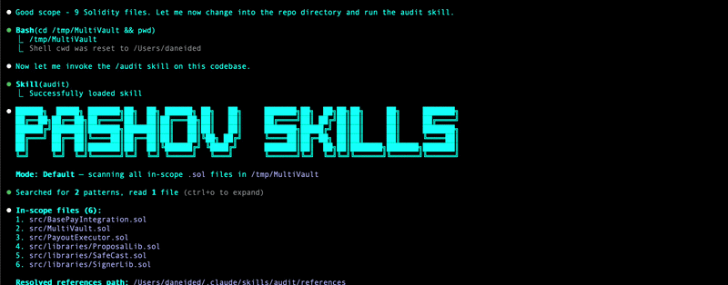

# TON Auditor

A security agent for **TON smart contracts**.

Attribution: this fork keeps the v2 packaging and audit workflow lineage from [pashov/skills](https://github.com/pashov/skills), adapted for TON contracts.

Built for:

- **TON developers** who want fast feedback before shipping FunC or Tact changes
- **Security researchers** who need a first pass over handlers, sends, and bounce flows
- **Auditors** who want broad vector coverage before deeper manual review

It is not a substitute for a full audit. It is the fast pass you should run before you trust a contract system.

## Demo

_Portrayed below: running the skill in a terminal workflow_



## Usage

```bash
/ton-auditor
/ton-auditor deep
/ton-auditor contracts/vault.fc contracts/router.tact
/ton-auditor --file-output
```

## Coverage

- **120 attack vectors** tuned for TON-specific security review
- **Parallel scan agents** for fast first-pass triage
- **Deep mode** for adversarial reasoning and TON protocol analysis

## What It Looks For

- unsafe external and internal message handling
- bounced-message gaps and supply/accounting drift after failed sends
- `accept_message()` misuse and gas draining vectors
- send-mode mistakes that break later logic or strand value
- Jetton sender / wallet validation bugs
- replay / seqno mistakes
- FunC storage packing/parsing hazards and Tact footguns
- upgrade and code/data replacement mistakes

## Tips

- **Audit recv handlers, bounce handlers, and send sites first.** Those functions usually contain the real TON trust boundaries.
- **Use `deep` for Jetton, vault, bridge, escrow, and governance systems.** Async inter-contract flows are where the highest-impact TON bugs usually hide.
